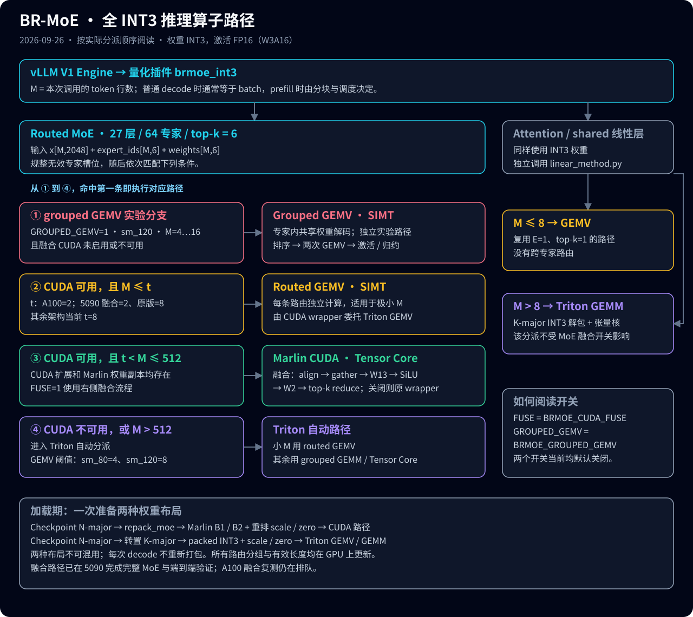

# BR-MoE: Bi-Level Tuning of Mixed-Precision Quantization and Low-Rank Compensators for Mixture-of-Experts Models

**Official Implementation of "BR-MoE: Bi-Level Tuning of Mixed-Precision Quantization and Low-Rank Compensators for Mixture-of-Experts Models"**


## 🎯 Overview

BR-MoE introduces a novel framework that jointly optimizes mixed-precision quantization and low-rank compensation for Mixture-of-Experts (MoE) models. Unlike existing approaches that treat bit-width selection and compensator rank allocation as independent problems, BR-MoE discovers and exploits the **hidden coupling** between these two dimensions through principled global optimization.

### 🔑 Key Innovations

- **Discovery of Bit-Rank Coupling**: First work to identify and formalize the complex interdependency between quantization bit-width and compensator rank in MoE models
- **Global Optimization Framework**: Transforms the intractable combinatorial problem into a solvable Integer Linear Programming (ILP) formulation
- **Efficient Proxy Metric**: Layer-wise quantization loss enables rapid evaluation of thousands of configurations without full model retraining
- **Superior Performance**: Achieves better accuracy-memory trade-offs than state-of-the-art methods across multiple MoE architectures

### 📊 Results Highlights

| Model | Method | Memory | WikiText2 PPL↓ | Average Score↑ |
|-------|---------|--------|---------------|----------------|
| Mixtral-8×7B | FP16 | 88.90GB | 3.700 | 80.48 |
| | GPTQ-3bit | 18.43GB | 4.730 | 73.80 |
| | HQQ-3bit | 20.55GB | 4.612 | 71.93 |
| | **BR-MoE** | **20.36GB** | **4.095** | **77.83** |
| DeepSeek-MoE | FP16 | 31.24GB | 5.832 | 68.82 |
| | GPTQ-3bit | 6.97GB | 6.843 | 62.14 |
| | **BR-MoE** | **8.18GB** | **6.180** | **67.70** |

### ⚡ 推理性能（vLLM 端到端, DeepSeek-MoE-16B 3-bit, 2026-09-26）

#### 最新：A100 全 INT3 与 FP16 同卡对照

**A100 80GB PCIe，TP=1，128 输入 / 128 输出，CUDA Graph，prefix cache 关闭，3 次取中位数。**
INT3 基线为旧 slot16 线性层且 MoE fusion 关闭；最终版开启 MoE 外围融合与 A100 专用线性分派。
attention、共享专家和 routed experts 均使用 INT3 权重，activation / KV cache 为 FP16。下表单位均为 ms。

| batch | FP16 TPOT | INT3 基线 TPOT | INT3 最终 TPOT | TTFT：FP16 → INT3 最终 | E2E：FP16 → INT3 最终 |
|---:|---:|---:|---:|---:|---:|
| 1 | 4.939 | 4.217 | 4.210 | 25.22 → 18.43 | 652.44 → 553.07 |
| 2 | 6.668 | 5.819 | 5.825 | 27.21 → 27.28 | 873.99 → 767.03 |
| 4 | 5.584 | 8.235 | 5.445 | 34.21 → 45.86 | 743.35 → 737.41 |
| 8 | 5.555 | 12.224 | 5.766 | 50.49 → 86.51 | 756.00 → 818.74 |
| 16 | 6.037 | 11.880 | 6.397 | 87.14 → 159.41 | 853.87 → 971.85 |
| 32 | 9.179 | 16.211 | 7.533 | 172.16 → 314.65 | 1337.93 → 1271.41 |
| 64 | 12.188 | 24.427 | 10.509 | 341.04 → 627.01 | 1888.94 → 1961.68 |
| 128 | 18.232 | 32.675 | 17.882 | 680.79 → 1254.19 | 2996.27 → 3525.17 |

**相对旧全 INT3，bs64 TPOT 降低 57.0%。** 对比当前 FP16，bs32/64/128 的 decode 分别快约 17.9% / 13.8% / 1.9%，
bs8/16 仍慢约 3.8% / 6.0%。**prefill 仍有差距**：bs128 完整请求为 3525.17 ms，FP16 为 2996.27 ms；
decode 的改善没有转化为所有 batch 的完整请求优势。

旧全 INT3 与最终版的正式入口 **97,920 个输出 token ID 全部一致**；**608 项数值 / CUDA Graph 检查通过**。
完整 shared+routed MoE 回放的 M64/128：**12.912 → 6.294 ms / 15.978 → 10.042 ms**。
FP16 使用本次 vLLM 的默认 Triton MoE 配置（本机缺少该专家形状的 A100 专用调优文件），不代表 FP16 性能上限。

```bash
export BRMOE_LINEAR_BACKEND=auto  # 默认；A100 M≤2 / 5090 M≤8 用 GEMV，其后至 M128 用专用 TC
export BRMOE_CUDA_FUSE=1         # 复现完整优化组合
```

专用 TC：BM/BN/BK=32/64/128、4 warps、3 stages（M≤16 时 BM=16）；M>128 使用 BK32、slot=BM。
共享专家由 vLLM runner 调度并同步相加；本轮观测到小 M 使用辅助 stream 重叠，M2048 不重叠。完整调用逻辑已更新到 HTML 第 5 张图。
[A100 报告与复现](docs/a100_full_int3_20260926.md) · [完整数字](docs/perf/a100_full_int3_20260926.json) ·
[Attention / shared 调用图](docs/brmoe-kernel-paths.html#panel4)。

#### 5090：共享专家与 attention 的 INT3 线性层

消除单权重 GEMM 的重复 slot 解码，并为中小 M 加入专用 INT3 Tensor Core kernel。
**RTX 5090，全 INT3，128 输入 / 128 输出，CUDA Graph，关闭 prefix cache，3 次取中位数。**
本轮 baseline 与新版本均启用 CUDA MoE 外围融合；表中为线性层优化的增量收益。

| batch | TPOT baseline → 新版本（ms/token） | 降幅 | 完整 shared+routed MoE 回放（ms） |
|---:|---:|---:|---:|
| 8 | 3.971 → 3.957 | 基本持平 | 1.981 → 1.982 |
| 16 | 5.560 → **3.370** | **39.4%** | 3.060 → **1.851** |
| 32 | 8.645 → **4.937** | **42.9%** | 5.046 → **2.801** |
| 64 | 14.193 → **6.809** | **52.0%** | 8.276 → **3.658** |
| 128 | 19.697 → **10.988** | **44.2%** | 9.530 → **5.147** |

bs1–8 decode 基本持平；bs128 TTFT **929.08 → 629.09 ms**。
正式插件入口对照的 **97,920 个输出 token ID 全部一致**；448 项数值 / CUDA Graph 验证通过。
MoE 列包括 27 层共享 MLP、routed MoE 及两分支相加，gate/top-k 使用已采集结果；
与此前只计 routed 分支的 MoE 列范围不同，也不能直接与 TPOT 相加。

```bash
export BRMOE_LINEAR_BACKEND=auto  # 默认：sm_80 / sm_120、FP16 / GS64；legacy 可回退
export BRMOE_CUDA_FUSE=1         # 复现本轮性能需同时启用 MoE 外围融合
```

9≤M≤128 使用 BM/BN/BK=32/64/128、4 warps、3 stages；M>128 使用 BK32、slot=BM；
5090 的 M≤8 保留原 GEMV；A100 后续已完成验证，使用上方阈值 2。
真实输入回放覆盖全部 112 个线性层；同 batch 内重复相同 prompt，尚未覆盖业务流量分布。
[完整报告与复现](docs/int3_linear_optimization_20260926.md) ·
[原始数字汇总](docs/perf/int3_linear_20260926.json) ·
[线性 kernel 执行图](docs/brmoe-int3-linear.svg)。

#### 上一阶段：全 INT3 模型的 CUDA MoE 外围融合

attention 与 MoE 均为 INT3（checkpoint 名称为 `brmoe-3bit-vllm-int3dense`）。
本轮保留 Marlin CUDA 矩阵乘，融合 **gather、SiLU×up、加权 top-k 归约与输出转换**，
跳过无效行；每层 MoE 的 GPU kernel 从 **23 个减少到 9 个**。

**RTX 5090，同卡先后对照，128 输入 / 128 输出，CUDA Graph，关闭 prefix cache，3 次取中位数。**
基线为未启用 grouped GEMV / CUDA fusion 实验开关的原分派。MoE 列是 27 层合计，
TPOT 为 `(E2E − TTFT) / 127`，两者不是同一个计时范围。

| batch | 完整 MoE 基线 → 融合（ms） | TPOT 基线 → 融合（ms/token） | TPOT 降幅 |
|---:|---:|---:|---:|
| 4 | 1.393 → **0.919** | 3.555 → **3.044** | **14.4%** |
| 8 | 2.762 → **0.926** | 5.896 → **3.975** | **32.6%** |
| 16 | 2.600 → **0.965** | 7.029 → **5.551** | **21.0%** |
| 32 | 3.815 → **1.781** | 9.859 → **8.743** | **11.3%** |

```bash
# 实验开关，默认关闭；CUDA 可用时优先于 BRMOE_GROUPED_GEMV
export BRMOE_CUDA_FUSE=1
```

80 组数值 / Graph 回放验证通过，端到端 **23,040 个输出 token ID 全部一致**。
实际插件开关复测 TPOT 为 3.05 / 3.98 / 5.54 / 8.70 ms。
上述真实路由来自同一 batch 内重复相同 prompt；随机分散路由下 M=4 略有回退，
M=8 基本持平，阈值还需按业务流量校准。A100 fusion 对照 39144 已完成，后续完整优化见上方 A100 结果。

完整方法、计时数据与复现命令：[CUDA MoE fusion 报告](docs/moe_cuda_fusion_20260926.md)。

[](docs/brmoe-kernel-paths.html)

路径图：[可缩放 HTML / 五张分图](docs/brmoe-kernel-paths.html) ·
[SVG 原图](docs/brmoe-kernel-paths.svg) ·
[Grouped GEMV 逐步交互讲解](docs/grouped_gemv_explainer.html)。

#### 大 batch 追加结果（全 INT3，RTX 5090）

同卡原版 / 融合版、128 输入 / 128 输出、3 次测量；86,016 个输出 token ID 全部一致。

| batch | 原版 TPOT（ms） | 融合 TPOT（ms） | 降幅 |
|---:|---:|---:|---:|
| 32 | 9.832 | **8.721** | 11.3% |
| 64 | 15.868 | **14.173** | 10.7% |
| 128 | 20.850 | **19.682** | 5.6% |

已采集 81 组真实 routed MoE 输入及 112 个 INT3 线性层的分阶段事件。
bs128 的采样区间中，共享专家 / attention 线性层约为 **8.39 / 5.15 ms**，
routed MoE 约 **5.48 ms**；这是独立采样口径，不能直接拼加为端到端 TPOT。
该线性层瓶颈已在上方最新结果中优化；此处保留当时的测量记录。

另做了共享内存申请量与寄存器占用对照：bs128 完整 routed MoE 回放再快约 6.2%，
但端到端 bs32/128 回退，因此两个新选项继续默认关闭。
[完整大 batch 报告与复现](docs/moe_large_batch_20260926.md) ·
[可查阅的原始数字汇总](docs/perf/moe_large_20260926.json)。

#### 融合前的历史测量

以下保留此前不同模型与优化阶段的结果，不与上方同卡 fusion 对照混为一组。
kernel 栈位于 `BR-MoE/kernels/` 与 `tools/brmoe_int3_vllm/`。
其他流程说明：[decode](docs/pipeline_decode.md) / [prefill](docs/pipeline_prefill.md)。

**RTX 5090（graph 模式, in=128 out=128, TPOT ms/tok ↓）**

| bs | int3dense 优化前 | brmoe3bit 优化前 | brmoe3bit 最终 | int3dense 最终 | +grouped GEMV¹ |
|---|---|---|---|---|---|
| 1 | 8.10 | 6.04 | **3.01** | **2.26** | — |
| 2 | 8.82 | 6.69 | **3.37** | **2.95** | — |
| 4 | 9.68 | 7.75 | **3.88** | **3.65** | **3.04** |
| 8 | 11.68 | 9.44 | **5.19** | **5.88** | **4.63** |
| 16 | 12.62 | 11.03 | **6.19** | **7.52** | **6.12** |

¹ 实验开关 `BRMOE_GROUPED_GEMV=1`（默认关，仅 sm_120 且 4≤M≤16），
详见 [docs/grouped_gemv_study_20260926.md](docs/grouped_gemv_study_20260926.md)。

"最终" = GEMV（小 M）+ Marlin CUDA grouped kernel（中段 M）+ Triton TC（大 M）
三级分派全部启用且数值校验通过（kernel 执行路径框图：
[docs/brmoe-kernel-paths.html](docs/brmoe-kernel-paths.html)）。

**Kernel 级：int3 分派路径 vs fp16（同一条 grouped 流水线，5090，zipf 路由）**

| M | 1 | 2 | 4 | 8 | 16 | 32 | 64 |
|---|---|---|---|---|---|---|---|
| int3 µs | 25.2 | 41.8 | 55.8 | 106.4 | 181.0 | 217.4 | 256.2 |
| fp16 µs | 116.7 | 150.7 | 218.3 | 331.0 | 423.7 | 569.6 | 654.8 |
| **加速比** | **4.64×** | **3.60×** | **3.91×** | **3.11×** | **2.34×** | **2.62×** | **2.56×** |

MoE GEMV 微基准在 5090 上 M=4 达 **1766 GB/s ≈ 98% 峰值带宽**；Marlin CUDA grouped
kernel 在 M=16~64 达 ~910 GB/s（50% 峰值）并 1.9× 于 Triton 张量核路径；
attention int3 linear 在 M=1 比 cuBLAS fp16 还快（4.3 µs vs 5.8 µs, **0.74×**）。

**A100 80GB PCIe（graph 模式, 同口径, 与 fp16 同卡对比）**

| bs | fp16 | brmoe3bit 前→后 | int3dense 最终 | brmoe3bit 最终 vs fp16 |
|---|---|---|---|---|
| 1 | 4.92 | 7.95 → **4.38** | **4.24** | **0.89× ✅ 反超** |
| 2 | 6.78 | 9.71 → **5.67** | **5.89** | **0.84× ✅ 反超** |
| 4 | 6.82 | 9.91 → **7.31** | 8.78 | 1.07× |
| 8 | 6.78 | → **8.42** | 12.66 | 1.24× |
| 16 | 8.35 | → **9.89** | 12.63 | 1.18× |
| 32 | 10.07 | → **11.30** | 16.50 | 1.12× |

A100 上 prefill 改善显著（TTFT bs1 31→22 ms，反超 fp16 的 26 ms）。
显存：权重 fp16 30.5 GiB → int3 **8.1 GiB**（-73%），KV cache 空间相应放大。

已知边界（诚实记录）：A100 bs≥4 的 decode 仍落后 fp16——Marlin CUDA kernel 在
sm_80 上只到 ~25% 峰值带宽（5090 为 50%），且 GEMV 逐路由重读权重在 M 增大后
流量反转；GEMV/CUDA 的交叉点按架构区分（sm_80: M≤2, sm_120: M≤8），由
`gemv_max_m=None` 自动选择。复现：`bench/vllm_perf_compare.slurm`、
`bench/verify_moe_cuda.py`、`bench/micro_moe.py`。

## 🚀 Quick Start

### Installation

1. **Set up conda environment**
```bash
cd BR-MoE
chmod +x conda_env_setup.sh
./conda_env_setup.sh
conda activate brmoe
```

2. **Install dependencies**
```bash
pip install -r requirements.txt
```

3. **Compile CUDA kernels** (Optional for acceleration)
```bash
chmod +x kernel_setup.sh
./kernel_setup.sh
```

### Basic Usage

#### 1. Compress a MoE Model

```python
import torch
from transformers import AutoModelForCausalLM
from BR_MoE.models.hf.qwen import Qwen15MoEBRMoE as AutoBRMoEHFModel
from BR_MoE.core.quantize import BaseCompressConfig

# Load model
model_path = "path/to/your/qwen1.5-moe"
model = AutoModelForCausalLM.from_pretrained(
    model_path,
    torch_dtype=torch.float16,
    trust_remote_code=True
)

# Configure compression settings
compress_config = BaseCompressConfig(
    nbits=3,                    # Base quantization bits
    group_size=128,             # Quantization group size
    sparse_rank=32,             # Compensator rank for experts
    dense_rank=512,             # Compensator rank for dense layers
    iter=20,                    # Optimization iterations
    compensator_dtype="int3",   # Compensator quantization
    quant_zero=False,           # Don't quantize zero points
    quant_scale=False,          # Don't quantize scales
    axis=1                      # Quantization axis
)

# Apply compression
device = "cuda"
AutoBRMoEHFModel.compress_model(model, compress_config=compress_config, device=device)

# Save compressed model
quant_model_dir = "path/to/save/compressed_model"
AutoBRMoEHFModel.save_compressed(model, quant_model_dir)
```

#### 2. Generate Optimal Configuration with ILP Solver

```bash
# Step 1: Collect quantization loss data for all expert configurations
python collect/collect_expert.py \
    --model_path "path/to/your/qwen1.5-moe" \
    --output_path "expert_impact_results.json" \
    --bit_options "2,3,4" \
    --rank_options "0,16,32,64,128"

# Step 2: Use ILP solver to find optimal allocation
python ILP_solver/solver.py \
    --l2_file "expert_impact_results.json" \
    --freq_file "expert_freq.json" \
    --memory_file "memory_usage.json" \
    --output_file "best_config.json" \
    --budget 8000.0 \
    --baseline "2bit_rank0" \
    --min_rank 16 \
    --max_rank 256
```

#### 3. Run with Optimal Configuration

```bash
# Edit BR_compress_Qwen15.py to set your model paths:
# model_path = "path/to/your/qwen1.5-moe"
# quant_model_dir = "path/to/save/compressed_model"

# Run compression with ILP-optimized configuration
python examples/BR_compress_Qwen15.py --config best_config.json
```

**Configuration file format (best_config.json):**
```json
{
  "L0_E0": "3bit_rank32",
  "L0_E1": "4bit_rank16", 
  "L1_E0": "2bit_rank64",
  "L1_E1": "3bit_rank0",
  ...
}
```

#### 3. Uniform Compression (Alternative)

```bash
# For uniform compression without ILP optimization
# Edit BR_compress_Mixtral_uniform.py to set model paths and run:
python examples/BR_compress_Mixtral_uniform.py
```

#### 4. Evaluation

```bash
# Edit BR_eval.py to set your model paths:
# quant_model_dir = "path/to/your/compressed_model"
# model_id = "mistralai/Mixtral-8x7B-v0.1"  # or your model ID

python examples/BR_eval.py
```

## 📁 Project Structure

```
BR-MoE-organized/
├── BR_MoE/                 # Core framework
│   ├── core/               # Quantization and compensation algorithms
│   ├── models/             # Model implementations (Mixtral, DeepSeek, Qwen)
│   ├── engine/             # Inference engine
│   ├── kernels/            # CUDA kernels for acceleration
│   ├── backends/           # Hardware backends
│   └── utils/              # Utility functions
├── ILP_solver/             # Integer Linear Programming solver
├── collect/                # Configuration collection scripts
├── evaluation/             # Evaluation framework
├── examples/               # Usage examples
├── model_statistics/       # Model analysis tools
├── imgs/                   # Documentation images
├── requirements.txt        # Python dependencies
├── conda_env_setup.sh      # Environment setup script
└── kernel_setup.sh         # CUDA kernel compilation
```

## 🧩 Additional Backends

### Triton int3 Grouped GEMM (`kernels/triton_int3/`)

A build-free **Triton** implementation of the 3.0-bit MoE grouped GEMM, as a portable counterpart
to the CUDA kernel in `kernels/brmoe`. One MoE layer = two grouped GEMMs + a fused
`silu(gate)*up`, with a fully device-side token alignment (zero host sync).

| M | int3 3.0 bpw | int4 4.0 bpw | fp16 16 bpw | per-expert int3 | per-expert fp16 |
|---|---|---|---|---|---|
| 1 | 0.724 | 0.769 | 0.617 | 3.173 | 2.638 |
| 8 | 1.594 | 1.724 | 1.466 | 5.190 | 8.081 |
| 512 | 6.585 | 7.387 | 6.152 | 9.533 | 17.028 |

ms per MoE layer, `E=8 K=2048 I=4096 topk=2 group=128`, Tesla T4 15 GB — **1.9–2.4×** faster than
this kernel's initial version and **1.7–4.4×** faster than the per-expert loop. `kernels/triton_int3/README.md`
documents the full methodology, the measured negative results (which tile shapes hurt and why) and
the bottleneck analysis.

> Run with `cd kernels/triton_int3 && python test_kernel.py --bench` (requires `triton>=2.1`).

## 🧠 Methodology

### The Co-Design Challenge

Traditional approaches treat quantization and compensation independently:
- **Mixed-precision quantization**: Allocates different bit-widths based on sensitivity
- **Low-rank compensation**: Adds compensator matrices to recover quantization errors

**BR-MoE's insight**: These dimensions are deeply coupled! The optimal compensator rank depends on the bit-width, and vice versa.

### Our Solution: ILP-Based Global Optimization

**BR-MoE Workflow:**

1. **Configuration Space Generation**: Create all possible (bit-width, rank) combinations
2. **Proxy Evaluation**: Measure layer-wise quantization loss for each expert-configuration pair
3. **ILP Formulation**: Cast as Multiple-Choice Knapsack Problem (MCKP)
4. **Global Optimization**: Use ILP solver to find optimal allocation under memory constraints

**Mathematical Formulation:**
```
Minimize: Σᵢ Σⱼ (Fᵢ · Lᵢⱼ) · xᵢⱼ
Subject to:
- Σⱼ xᵢⱼ = 1, ∀i (each expert gets exactly one config)
- Σᵢ Σⱼ Mⱼ · xᵢⱼ ≤ B (memory budget constraint)
```

Where:
- `Fᵢ`: Expert activation frequency (importance weight)
- `Lᵢⱼ`: Layer-wise quantization loss for expert i with config j
- `Mⱼ`: Memory cost of configuration j
- `B`: Total memory budget
- `xᵢⱼ`: Binary decision variable (1 if expert i uses config j)

The ILP solver systematically explores the configuration space and guarantees finding the globally optimal solution within the given memory budget.

## 🔬 Supported Models

| Model | Architecture | Experts | TopK | Status |
|-------|-------------|---------|------|--------|
| Mixtral-8×7B | Sparse MoE | 8 | 2 | ✅ Supported |
| DeepSeek-V2-Lite | Hybrid MoE | 64+2 | 6 | ✅ Supported |
| Qwen1.5-MoE | Dense+MoE | 60+4 | 4 | ✅ Supported |
| Switch Transformer | Custom | Variable | Variable | 🚧 Coming Soon |

## 📈 Performance Comparison

### Memory-Accuracy Trade-offs


BR-MoE consistently achieves superior accuracy at similar memory footprints compared to:
- **GPTQ**: Calibration-based quantization
- **HQQ**: Calibration-free quantization  
- **MiLo**: MoE-specific low-rank compensation
- **Mixed-Precision Heuristics**: Frequency-based allocation

### Scalability Analysis

Our ILP solver efficiently handles the combinatorial explosion:
- **Complexity**: O(|E| × |B| × |R|) for configuration evaluation + ILP solving
- **Practical Runtime**: < 10 seconds for typical MoE models
- **Memory Efficient**: Proxy evaluation avoids full model loading

## 📊 Evaluation Framework

### Supported Benchmarks

- **Language Modeling**: WikiText-2
- **Reading Comprehension**: HellaSwag, LAMBADA
- **Commonsense Reasoning**: PIQA, WinoGrande
- **Multi-task**: MMLU (57 tasks)

### Custom Evaluation

```python
from BR_MoE.evaluation import evaluate_model

results = evaluate_model(
    model_path="path/to/compressed_model",
    tasks=["wikitext2", "hellaswag", "piqa"],
    batch_size=8,
    device="cuda"
)
```

## 🔧 Configuration Options

### Quantization Settings

| Parameter | Description | Default | Options |
|-----------|-------------|---------|---------|
| `nbits` | Quantization bit-width | 3 | 2, 3, 4, 8 |
| `group_size` | Quantization group size | 128 | 32, 64, 128, 256 |
| `quant_zero` | Quantize zero points | False | True, False |
| `quant_scale` | Quantize scales | False | True, False |

### Compensation Settings

| Parameter | Description | Default | Options |
|-----------|-------------|---------|---------|
| `sparse_rank` | Expert compensator rank | 32 | 0, 16, 32, 64, 128, 256 |
| `dense_rank` | Dense layer compensator rank | 512 | 0, 256, 512, 1024 |
| `compensator_dtype` | Compensator quantization | "int3" | "fp16", "int4", "int3" |
| `rank_strategy` | Rank allocation strategy | "custom" | "uniform", "frequency", "custom" |

### Optimization Settings

| Parameter | Description | Default | Range |
|-----------|-------------|---------|-------|
| `iter` | Optimization iterations | 20 | 5-50 |
| `lr` | Learning rate | 0.01 | 0.001-0.1 |
| `solver_timeout` | ILP solver timeout (s) | 300 | 60-3600 |

### ILP Solver Settings

| Parameter | Description | Example | Notes |
|-----------|-------------|---------|-------|
| `--l2_file` | Expert quantization loss results | `expert_impact_results.json` | Generated by collect step |
| `--freq_file` | Expert activation frequencies | `expert_freq.json` | Importance weights |
| `--memory_file` | Memory usage for each config | `memory_usage.json` | Memory constraints |
| `--budget` | Memory budget (MB) | `8000.0` | Total allowed memory increase |
| `--baseline` | Baseline configuration | `"2bit_rank0"` | Reference config for memory calculation |
| `--min_rank` | Minimum compensator rank | `16` | Lower bound for rank allocation |
| `--max_rank` | Maximum compensator rank | `256` | Upper bound for rank allocation |

<!-- ## 📚 Citation

If you find BR-MoE useful in your research, please cite our paper:

```bibrex
@inproceedings{brmoe2025,
    title={BR-MoE: Beyond Heuristics in MoE Model Compression},
    author={Your Name and Co-authors},
    booktitle={International Conference on Learning Representations},
    year={2025},
    url={https://openreview.net/}
}
``` -->


## 🙏 Acknowledgments

- Thanks to the open-source community for foundational tools
- Model providers: Meta (Mixtral), DeepSeek, Alibaba (Qwen)
- Evaluation framework: EleutherAI lm-evaluation-harness
