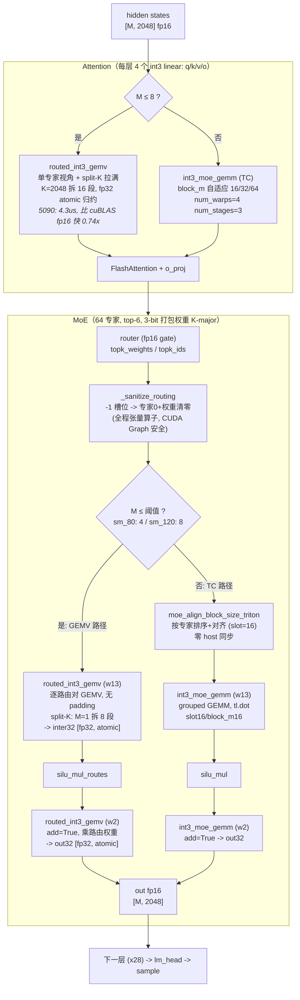

# Decode 算子流程（小 batch, vLLM + brmoe_int3）

decode 每步每层的真实执行路径（`tools/brmoe_int3_vllm/` + `BR-MoE/kernels/triton_int3/int3_moe/`）。
路径分派阈值：A100 (sm_80) GEMV 用于 M≤4，5090 (sm_120) 用于 M≤8，超出走张量核心（TC）路径。

## 关键设计

| 组件 | 文件 | 说明 |
|---|---|---|
| 权重布局 | `moe_method.py::process_weights_after_loading` | 加载后转置成 K-major `[E, Kpack, N]`，GEMV 的 w 载入沿 n 连续 → 合并访存（+5~19%）|
| GEMV split-K | `int3_moe/kernel.py::_routed_int3_gemv` | grid 第三维拆 K，部分和 fp32 atomic；小 M 下把 program 数从几百提到几千 |
| 自动分派 | `int3_moe/ops.py::fused_moe_int3` | 按 (架构, M) 选 GEMV/TC；阈值是 e2e 实测定的（随机路由 micro 会高估 GEMV 的适用范围）|
| 数值 | `bench/micro_moe.py --check` | 三条路径都与反量化金标准逐层比对（rel < 5e-4）|
