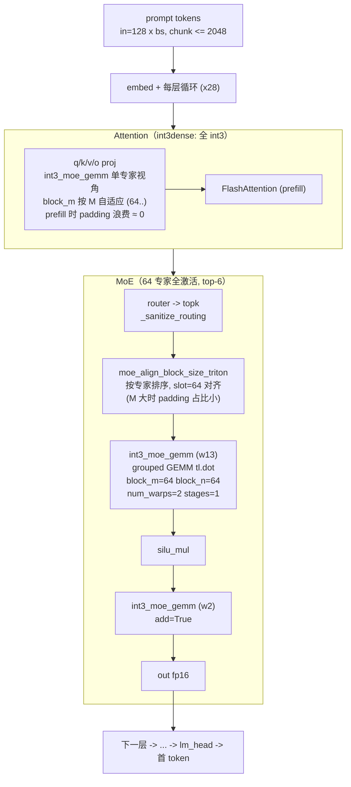

# Prefill 算子流程（大 batch / 长 prompt, vLLM + brmoe_int3）

prefill 时 M 大（chunked prefill, `max_num_batched_tokens=2048`），全部走张量核心（TC）
grouped GEMM 路径——GEMV 的逐路由对读取在这个区间没有任何优势。

## 现状与已知边界（A100 实测，2026-09-26）

- prefill 是**算力受限**场景：权重被反复复用，3-bit 省字节的优势天然减弱
- int3 TC kernel 在 M=512/2048 只有 10.8% / 3.1% 峰值带宽；cuBLAS fp16 参照也只有
  51.5% / 23.5% —— 这个区间两家都远离带宽墙，瓶颈在反量化 ALU 与 MMA 的排布
- 大 M 下 `slot=64/block_m=64` 反而最优（padding 占比小，大 tile 喂得饱张量核心）
- 已知的下一步候选：int4d 布局（去掉 `tl.where` 解包链）在 TC 路径的 M>=16 区间
  尚未充分验证；`block_n=256` 在 M>=512 会出现灾难性回退（25ms, 勿用）

## 一次请求的完整生命周期

